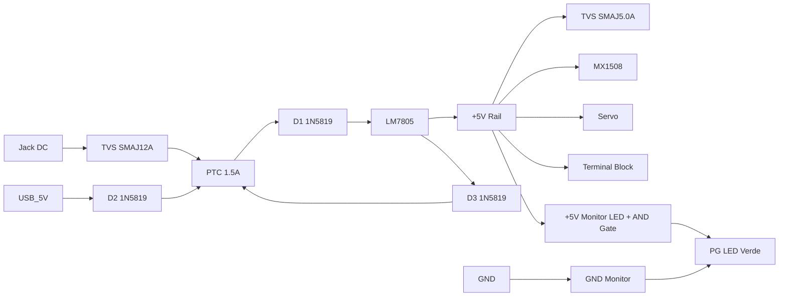

# Alimentación - Protecciones

## Protecciones implementadas

| Protección | Componente | Ubicación | Función |
|------------|------------|-----------|---------|
| **Polaridad inversa** | 1N5819 (D1) | Entrada Jack DC | Bloquea Vin negativo |
| **Oring USB/Jack** | 1N5819 (D2) | Entrada USB 5V | Previene backfeed |
| **Descarga C_OUT** | 1N5819 (D3) | LM7805 OUT→IN | Protege regulador al apagar |
| **Térmica LM7805** | Interno | Silicio | Shutdown @ 150°C |
| **Térmica AMS1117** | Interno | Silicio | Shutdown @ 150°C |
| **Térmica MX1508** | Interno | Silicio | Shutdown @ 150°C |
| **Límite corriente MX1508** | Interno | Driver | ~2.5A peak/canal |

---

## Esquemas de protección

### 1. Diodo polaridad inversa (Jack DC)
```
JACK DC (+) ──►│──► Vin_net
         D1 (1N5819)
JACK DC (-) ──────► GND

Si Vin inverso: D1 bloqueado → 0V en circuito → Sin daño
Caída: Vf ≈ 0.3V (Schottky) vs 0.7V (Si)
```

### 2. ORing USB / Jack DC
```
JACK DC (+) ──►│──┐
         D1     │
               ├──► Vin_net → LM7805 IN
USB 5V (+) ──►│──┘
         D2 (1N5819)

Comportamiento:
- Solo Jack (9-12V): D1 ON, D2 OFF (5V USB < Vin - Vf)
- Solo USB (5V): D2 ON, D1 OFF (Jack = 0V)
- Ambos: El de mayor voltaje gana (típicamente Jack)
```

### 3. Diodo descarga capacitor salida (LM7805)
```
LM7805 OUT ──►│──► LM7805 IN
         D3 (1N5819)

Al apagar Vin:
- C_OUT (100µF) se descarga por D3 hacia IN
- Evita que V_OUT > V_IN + Vf (daña regulador)
- Crítico si C_OUT grande y carga inductiva
```

---

## Protecciones NO implementadas (planificadas v0.5+)

| Protección | Componente sugerido | Ubicación | Prioridad |
|------------|---------------------|-----------|-----------|
| **PTC Resettable Fuse** | 500mA-1A (0805/1206) | Serie Vin | Alta |
| **TVS Diode** | SMAJ12A / SMAJ5.0A | Entrada Vin / +5V Rail | Alta |
| **Power Good LED** | AND lógico (5V && 3.3V) | Indicador visual | Media |
| **Current Sense Jumper** | 0Ω / Header 2p | Serie +5V, +3.3V | Media |
| **Reverse USB** | MOSFET ideal diode | Entrada USB | Baja |

### PTC Fuse (Polyswitch) - Recomendado
```
Vin ──► [PTC 1A] ──► LM7805 IN

Ejemplos:
- 0.5A hold / 1A trip: 0ZCG0050FF2C (1206)
- 1A hold / 2A trip: 0ZCG0100FF2C (1206)
- 1.5A hold / 3A trip: 0ZCG0150FF2C (1206)

Auto-rearme tras enfriar. Sin reemplazar fusible.
```

### TVS Diode (Protección transitorios/ESD)
```
Entrada Jack:
Vin ──►┬──► LM7805 IN
       │
      TVS (SMAJ12A para 12V max, o SMAJ5.0A para 5V USB)
       │
      GND

Rail +5V:
+5V ──►┬──► Carga
       │
      TVS (SMAJ5.0A o SMAJ6.0A)
       │
      GND

Especificaciones TVS:
- VRWM (Stand-off): ≥ Voltaje nominal rail
- VBR (Breakdown): VRWM × 1.1-1.2
- Vc (Clamping): < 2× VRWM
- Ppk (Pico potencia): ≥ 400W (SMA) / 600W (SMB)
```

---

## Análisis fallos (FMEA)

| Modo fallo | Causa | Efecto | Detección | Mitigación actual | Mejora |
|------------|-------|--------|-----------|-------------------|--------|
| Vin polaridad inversa | Usuario error | Quema LM7805, MCU | D1 bloquea | 1N5819 Serie | ✅ OK |
| USB backfeed a Jack | PC conectada + Jack | Daña fuente Jack | D2 bloquea | 1N5819 ORing | ✅ OK |
| C_OUT descarga en LM7805 | Apagado brusco | Daña regulador | D3 descarga | 1N5819 OUT→IN | ✅ OK |
| Sobrecorriente +5V | Cortocircuito carga | Caída voltaje, calor | Térmica LM7805 | Interno 150°C | ⚠️ Lento |
| Pico corriente motor | Arranque motor | Brownout ESP32 | Monitor A9013 | Cap 100µF + 100nF | ⚠️ Margen |
| ESD conector usuario | Manipulación | Daña GPIO/ESD | Ninguna | Diodos internos ESP32 | ❌ Falta TVS |
| Sobretensión Vin | Fuente errónea | Quema LM7805 | Ninguna | Ninguna | ❌ Falta TVS |

---

## Mejoras v0.5 planificadas



---

## Testing protecciones

### Test polaridad inversa
```bash
# 1. Conectar Jack con polaridad inversa (centro negativo)
# 2. Medir Vin_net → Debe ser 0V
# 3. Verificar LM7805 no calienta
# 4. Reconectar correcto → Funciona normal
```

### Test ORing
```bash
# 1. Solo Jack 9V → +5V Rail = 5V ✓
# 2. Solo USB → +5V Rail = ~4.7V (drop D2) ✓
# 3. Jack 9V + USB → +5V Rail = 5V (Jack gana) ✓
# 4. Desconectar Jack → Transición suave a USB ✓
```

### Test térmico LM7805
```bash
# 1. Cargar +5V Rail con 1A (resistencia 5Ω 5W)
# 2. Medir temp LM7805 (termocupla o IR)
# 3. Debe estabilizarse < 100°C con disipador PCB
# 4. Sin disipador → Apagado térmico ~2-3 min
```

### Test brownout motor
```cpp
void testMotorBrownout() {
  float v5v_before = readV5V();  // Divisor tensión + ADC
  motorA(255);  // Full PWM
  delay(100);
  float v5v_during = readV5V();
  motorA(0);
  
  Serial.printf("5V: %.2fV → %.2fV (drop %.2fV)\n", 
                v5v_before, v5v_during, v5v_before - v5v_during);
  // Drop > 0.3V = riesgo brownout ESP32
}
```

---

## Referencias

- [1N5819 Datasheet](https://www.onsemi.com/pdf/datasheet/1n5819-d.pdf)
- [LM7805 Thermal Design](https://www.ti.com/lit/an/slva118/slva118.pdf)
- [TVS Diode Selection Guide](https://www.littelfuse.com/~/media/electronics/datasheets/tvs_diode_arrays/littelfuse_tvs_selection_guide.pdf)
- [PTC Resettable Fuses](https://www.littelfuse.com/products/circuit-protection/ptc-resettable-fuses.aspx)